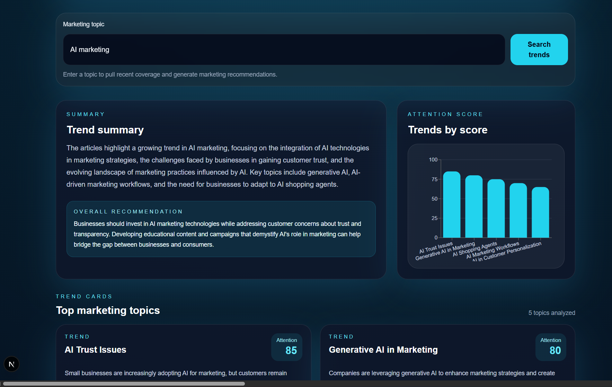
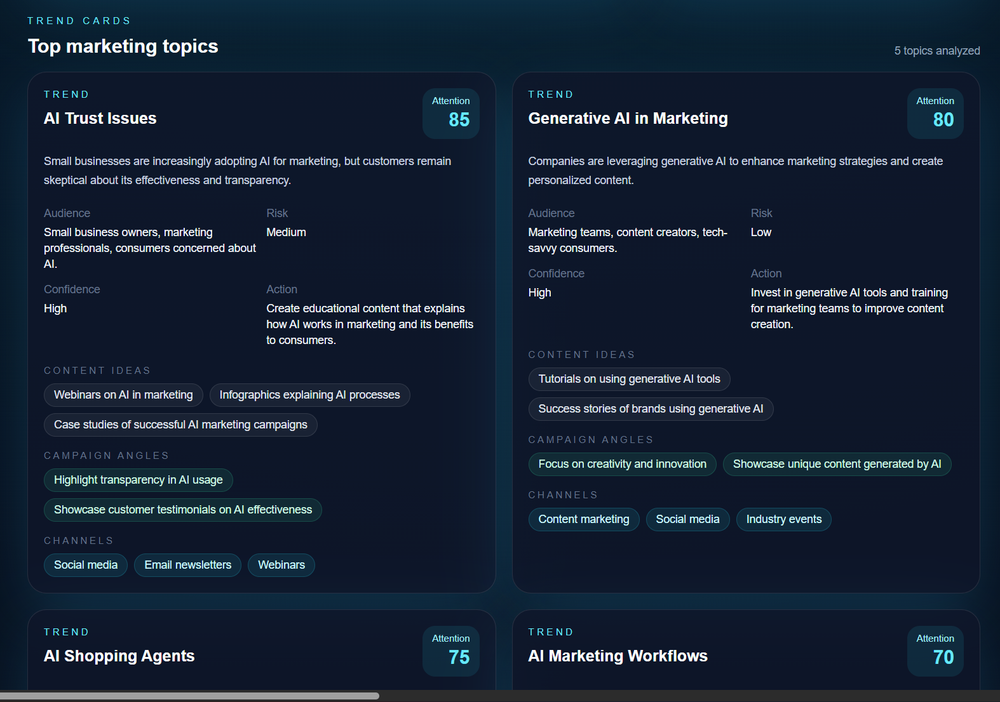
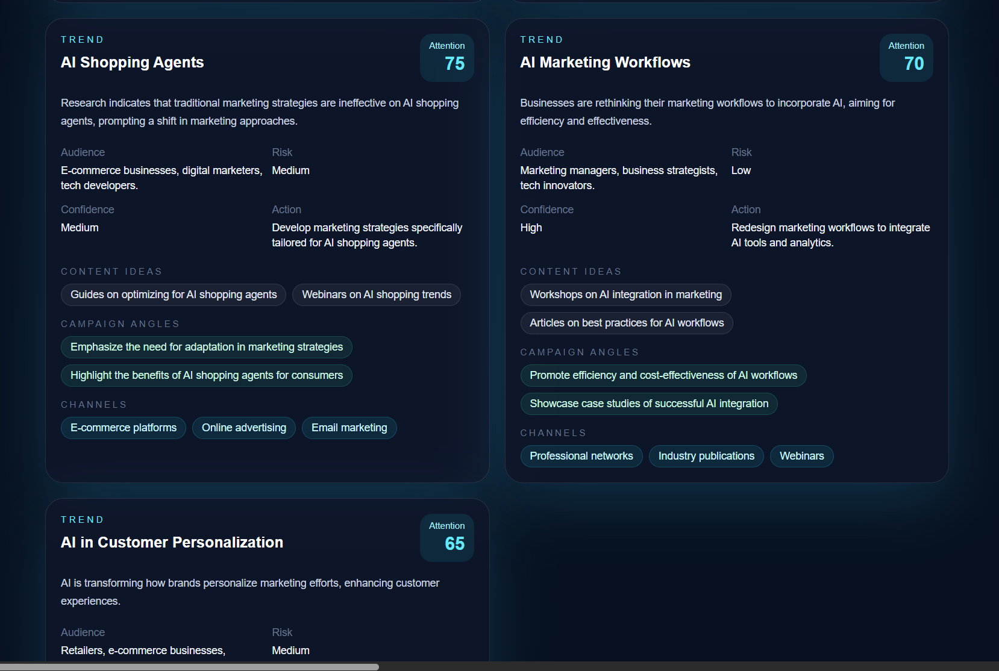
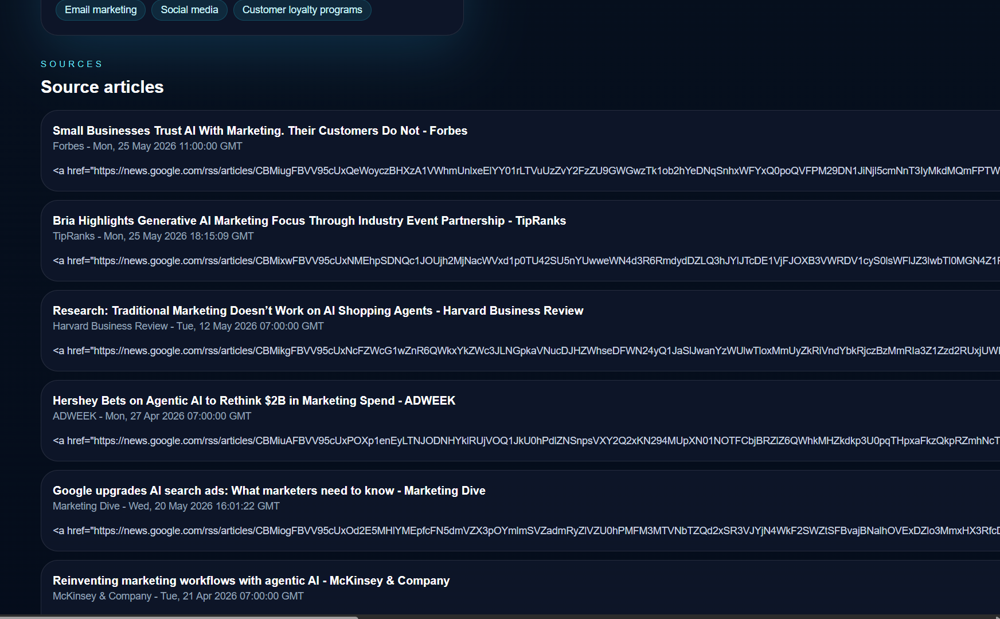

# Marketing Trend Radar

> A source-backed marketing intelligence dashboard that turns recent news coverage into trend summaries, attention scoring, and actionable campaign ideas.

<table>
  <tr>
    <td align="center">
      
      <br />
      <strong>Overview</strong>
    </td>
    <td align="center">
      
      <br />
      <strong>Trend cards</strong>
    </td>
  </tr>
  <tr>
    <td align="center">
      
      <br />
      <strong>Deep-dive insights</strong>
    </td>
    <td align="center">
      
      <br />
      <strong>Source traceability</strong>
    </td>
  </tr>
</table>

## What It Shows

- Search any marketing topic and pull fresh coverage into a focused dashboard.
- Turn raw articles into a readable trend summary with a clear overall recommendation.
- Rank the strongest topics by attention score so the most relevant themes stand out immediately.
- Show practical context for each topic, including audience, risk, confidence, action, content ideas, campaign angles, and channels.
- Keep every insight traceable with a source article section so the underlying coverage is visible.

## Data Sources

The app uses free, no-key news sources:

- `GDELT Doc API` for broad article discovery.
- `Google News RSS search feeds` as a free fallback when GDELT is throttled or unavailable.

The backend endpoint that powers the dashboard is:

- `GET /fetch-gdelt?query=...&max_articles=20`

Despite the name, the endpoint now returns articles from GDELT first and falls back to Google News RSS automatically.

## Why It Stands Out

- The interface is intentionally high-contrast and card-driven, so trends read like a live intelligence brief instead of a generic list.
- The visual hierarchy surfaces the most important signals first: summary, chart, ranked topics, then raw sources.
- Each insight card pairs strategy guidance with evidence-backed context, which makes it easier to turn trends into action.

## Requirements

- Node.js 18+ for the frontend
- Python 3.10+ for the backend
- `npm`
- `pip`

## Project Structure

- `backend/` - FastAPI service that fetches and analyzes trend data
- `frontend/` - Next.js dashboard UI

## Setup

### 1. Backend

```bash
cd backend
python -m venv .venv
.venv\Scripts\activate
pip install -r requirements.txt
copy .env.example .env
```

Set the required backend values in `backend/.env`:

- `OPENAI_API_KEY`
- `LLM_MODEL`
- `FRONTEND_ORIGIN`
- `GDELT_TIMEOUT_SECONDS`

Start the API:

```bash
uvicorn app.main:app --reload
```

### 2. Frontend

Open a second terminal:

```bash
cd frontend
npm install
copy .env.example .env
```

Set the frontend API base URL in `frontend/.env`:

- `NEXT_PUBLIC_API_BASE_URL`

Start the web app:

```bash
npm run dev
```

## How To Run

1. Start the backend first.
2. Start the frontend after the API is running.
3. Open the frontend in your browser and use the dashboard to search and analyze trends.

## API Endpoints

- `GET /` - health check
- `GET /fetch-gdelt?query=AI%20marketing&max_articles=20` - returns cleaned article results from GDELT or the Google News RSS fallback
- `POST /analyze-trends` - returns the trend analysis output

## Notes

- The backend must be reachable from the frontend through `NEXT_PUBLIC_API_BASE_URL`.
- If you change environment variables, restart both servers.
